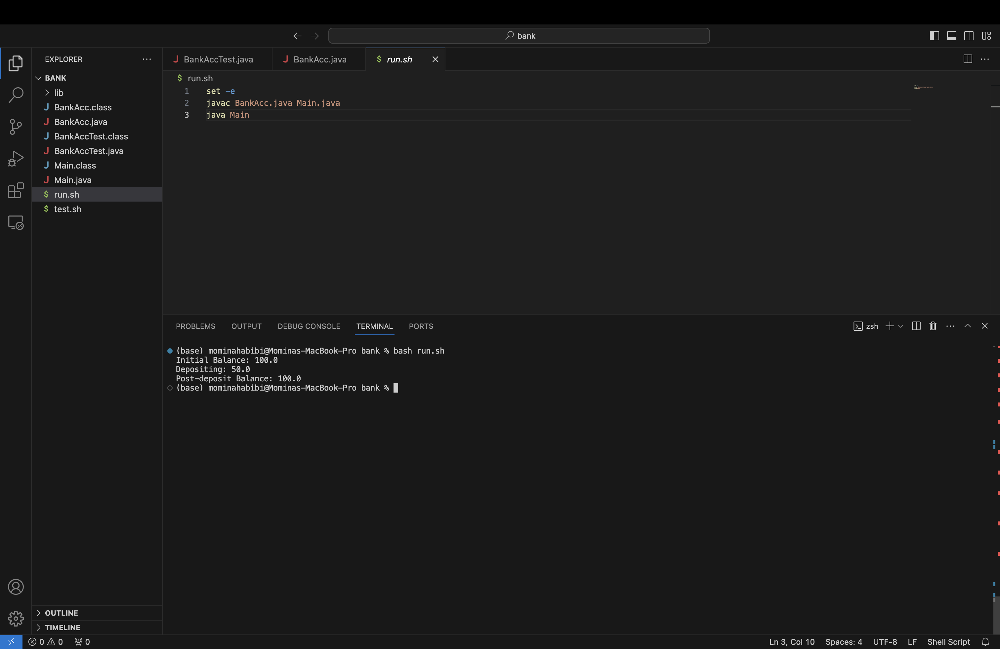
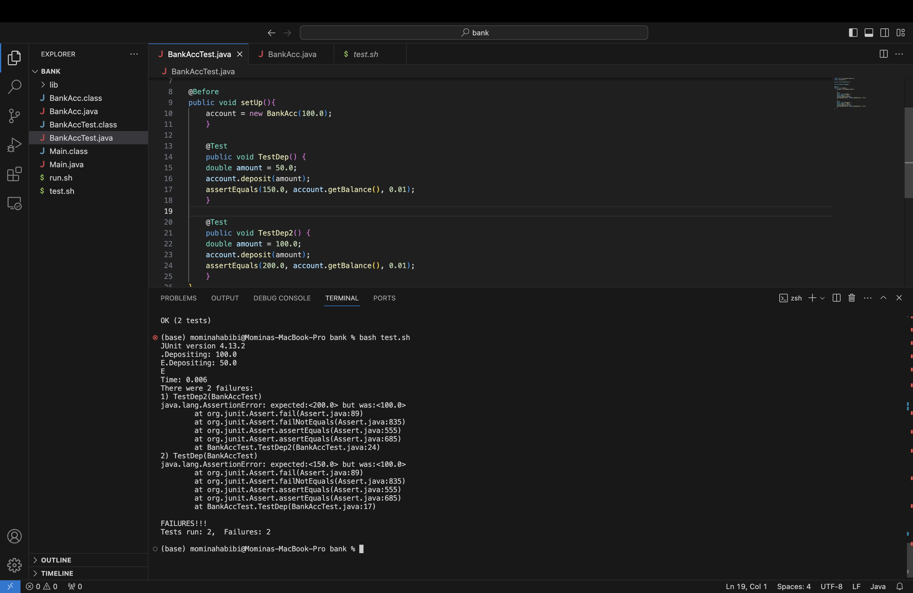

# Lab Report 5 - Putting it All Together
*By Momina Habibi*

## Part1 - Debugging Scenario

1. The original post from a student with a screenshot showing a symptom and a description of a guess at the bug/some sense of what the failure-inducing input is.

## Original Student(Mark) Post on EdStem:
Hi everyone,

I am working on a simple banking application in Java, The application is supposed to update the balance after a deposit, but it is not working. Here is a screenshot of the output after running my bash script which compiles and runs the Java program.



I think the bug might be related to how the balance is calculated after the deposit, but I am not sure. The failure seems to occur with any deposit amount.




2. A response from a TA asking a leading question or suggesting a command to try
   ## TA Response:
   Hi Mark,

   It loo


3. Another screenshot/terminal output showing what information the student got from trying that, and a clear description of what the bug is.


5. At the end, all the information needed about the setup including:
- The file & directory structure needed
  BankAcc.java is a class for bank account
  Main.java is a main class to run the application
  BankAccTest.java is a class for test different input...
  run.sh is a bash script to compile and run the java program
  test.sh is a bash script to...
  
- The contents of each file before fixing the bug
  BankAcc.java
  ```
  public class BankAcc {
    private double balance;

    public BankAcc(double initialBalance) {
        this.balance = initialBalance;
    }

    public void deposit(double amount) {
        
        System.out.println("Depositing: " + amount);
    }

    public double getBalance() {
        return balance;
    }
}
```
  Main.java
  ```
  public class Main {
    public static void main(String[] args) {
        BankAcc account = new BankAcc(100.0); // Starting with $100

        System.out.println("Initial Balance: " + account.getBalance());
        account.deposit(50.0);
        System.out.println("Post-deposit Balance: " + account.getBalance());
    }
}
```
BankAccTest.java
```
import static org.junit.Assert.*;
import org.junit.*;

public class BankAccTest {

private BankAcc account;

@Before
public void setUp(){
    account = new BankAcc(100.0);
    }
 
    @Test 
	public void TestDep() {
    double amount = 50.0;
    account.deposit(amount);
    assertEquals(150.0, account.getBalance(), 0.01);
	}

	@Test 
	public void TestDep2() {
    double amount = 100.0;
    account.deposit(amount);
    assertEquals(200.0, account.getBalance(), 0.01);
	}
}
```
run.sh
```
set -e
javac BankAcc.java Main.java
java Main
```
test.sh
```
set -e
javac -cp .:lib/hamcrest-core-1.3.jar:lib/junit-4.13.2.jar *.java
java -cp .:lib/hamcrest-core-1.3.jar:lib/junit-4.13.2.jar org.junit.runner.JUnitCore BankAccTest
```

- The full command line (or lines) you ran to trigger the bug
bash run.sh

bash test.sh

- A description of what to edit to fix the bug


## Part 2 - Reflection

During the second half of this quarter, I learned about Vim text editor which I did not know before. One especially cool feature of Vim that I discovered is its extensive use of keyboard shortcuts for almost every text editing task. I think this feature makes Vim incredibly efficient for coding and text editing once you get used to it. Also, it allows for quick navigation and editing in large files without relying on a mouse. As an example, I can move the cursor around quickly without a mouse, jump to specific words or characters with ease, and delete or copy entire lines very easily. Another interesting feature of Vim is the ability to record and play macros which means you can record a series of commands to perform a task and then replay those commands with a single keystroke. It can save a lot of time, especially with more complex and repetitive tasks.  


